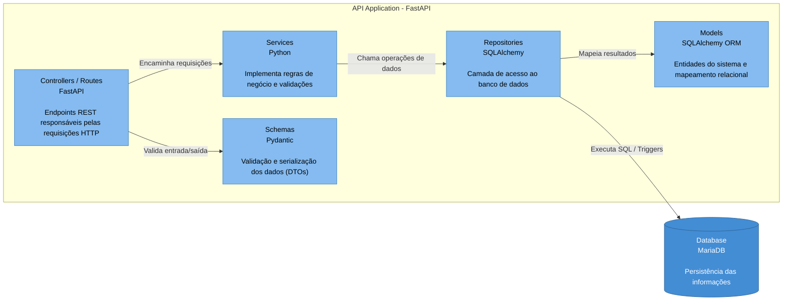

```mermaid
flowchart LR

    %% Estilos
    classDef component fill:#85bbf0,stroke:#3c7fc0,color:#000
    classDef database fill:#438dd5,stroke:#2e6290,color:#fff

    subgraph APIBoundary["API Application - FastAPI"]

        Controllers["Controllers / Routes<br>FastAPI<br><br>Endpoints REST responsáveis pelas requisições HTTP"]
        Services["Services<br>Python<br><br>Implementa regras de negócio e validações"]
        Repositories["Repositories<br>SQLAlchemy<br><br>Camada de acesso ao banco de dados"]
        Models["Models<br>SQLAlchemy ORM<br><br>Entidades do sistema e mapeamento relacional"]
        Schemas["Schemas<br>Pydantic<br><br>Validação e serialização dos dados (DTOs)"]

    end

    DB[("Database<br>MariaDB<br><br>Persistência das informações")]

    Controllers -->|Encaminha requisições| Services
    Services -->|Chama operações de dados| Repositories
    Repositories -->|Executa SQL / Triggers| DB
    Controllers -->|Valida entrada/saída| Schemas
    Repositories -->|Mapeia resultados| Models

    class Controllers,Services,Repositories,Models,Schemas component
    class DB database
```
