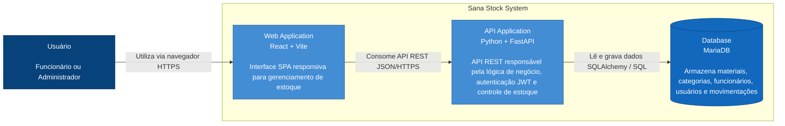

```mermaid
flowchart LR

    %% Estilos
    classDef person fill:#08427b,stroke:#052e56,color:#fff
    classDef container fill:#438dd5,stroke:#2e6290,color:#fff
    classDef database fill:#1168bd,stroke:#0b4884,color:#fff

    User["Usuário<br><br>Funcionário ou Administrador"]

    subgraph SanaBoundary["Sana Stock System"]

        WebApp["Web Application<br>React + Vite<br><br>Interface SPA responsiva para gerenciamento de estoque"]

        API["API Application<br>Python + FastAPI<br><br>API REST responsável pela lógica de negócio, autenticação JWT e controle de estoque"]

        DB[("Database<br>MariaDB<br><br>Armazena materiais, categorias, funcionários, usuários e movimentações")]

    end

    User -->|Utiliza via navegador HTTPS| WebApp

    WebApp -->|Consome API REST JSON/HTTPS| API

    API -->|Lê e grava dados SQLAlchemy / SQL| DB

    class User person
    class WebApp,API container
    class DB database
```
